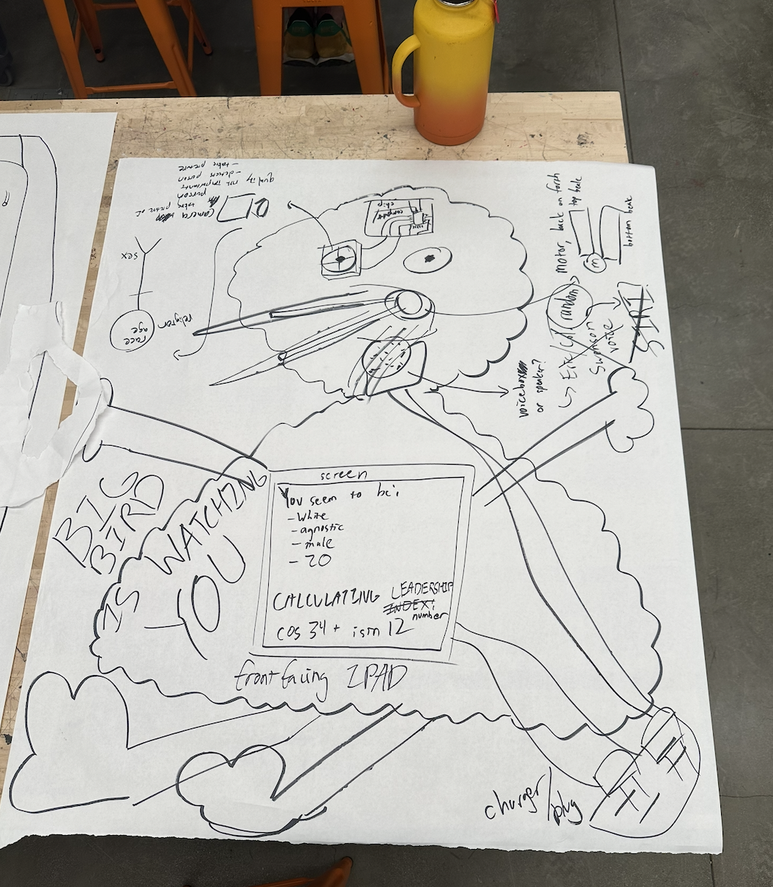

# Design Memo: Big Bird is Watching You

**The Game of Democracy: Art, Engineering, Chance, Choice, and Civic Life**
Instructors: Harriet B. Nembhard (Engineering), Ken Fandell (Art)
Harvey Mudd College

Felix Peng
April 1, 2026

---

## Team Problem Statement

People trust machines to be objective, even when those machines are doing something deeply subjective. When an algorithm looks at a person and assigns them a score, a rating, a category, most people accept it without questioning the math or the assumptions baked into the system. This is a growing problem across hiring platforms, predictive policing tools, credit scoring, and social media content curation, where opaque algorithms classify people by demographic proxies and spit out numbers that feel authoritative but are built on bias. The impact is real: research consistently shows these systems reinforce racial, gender, and socioeconomic inequality, and the people being scored rarely know enough to push back.

The goal is to make that invisible dynamic visible and visceral. Big Bird is Watching You is an interactive art installation that puts a participant in front of an AI system, lets it classify them by race, gender, age, religion, socioeconomic status, and education level, runs a theatrical "calculation" of their "Leadership Index," and then delivers a score that is literally meaningless: a randomly selected mathematical expression like "the square root of negative seven" or "aleph-null." The demographic inputs have zero weight. The score is pure noise. But the participant doesn't know that. They feel judged. They wonder if their race affected the result. They compare scores with the next person and realize the numbers can't even be ranked. The piece succeeds when participants walk away questioning whether any algorithmic score they've ever received was any more meaningful than this one.

---

## Representation

### Description

Big Bird is Watching You is a physical interactive installation centered around a modified 22-inch Big Bird plush puppet. A Raspberry Pi 5 is housed inside the puppet body, connected to a camera module mounted in Big Bird's eye socket, a small speaker mounted near the throat, and a 7-inch HDMI display mounted on or near the puppet's chest. A large 100mm red arcade button sits on a wooden podium in front of the puppet.

The participant presses the button. The camera captures their photo. An AI vision model (OpenAI gpt-4o-mini) guesses their demographics. These guesses scroll onto the screen and are narrated aloud in a flat robotic voice. Then a pseudoscientific "calculation theater" runs (fake jargon lines like "Measuring cranial symmetry..." and "Computing Bayesian leadership posterior..."). Finally, a procedurally generated, mathematically absurd "Leadership Index" is announced. The entire cycle takes about 30 seconds. Then it resets for the next person.

### Schematics

The system architecture runs entirely on the Raspberry Pi 5:

```
+---------------------------------------------------------+
|                     Raspberry Pi 5                       |
|                                                          |
|   Pi Camera Module 3 (in Big Bird's eye)                |
|       |                                                  |
|       v                                                  |
|   Flask Backend (port 8080)                             |
|       |-- POST /api/capture  (captures JPEG frame)      |
|       |-- POST /api/analyze  (sends to OpenAI API)      |
|       |-- /api/video_feed    (MJPEG live stream)        |
|       |-- SocketIO           (phase state machine)      |
|       v                                                  |
|   Chromium (Kiosk Mode, fullscreen)                     |
|       |-- Single-page web app (HTML/CSS/JS)             |
|       |-- Phases: IDLE > CAPTURING > ANALYZING >        |
|       |           CALCULATING > REVEALING > RESETTING   |
|       v                                                  |
|   7" HDMI Display (mounted on puppet)                   |
|                                                          |
|   GPIO 17 <-- 100mm Red Arcade Button (on podium)       |
|   USB Audio Adapter --> Speaker (in puppet throat)       |
|   Active Cooler (on Pi, vented through fabric)          |
+---------------------------------------------------------+
         |
         | HTTPS (WiFi)
         v
   OpenAI API (gpt-4o-mini, cloud)
```

### Physical Layout Sketch



The sketch shows Big Bird holding/presenting a front-facing screen (labeled "front facing IPAD" in the concept sketch, realized as a 7" HDMI display). The camera is in the eye. Internal annotations show the Raspberry Pi, speaker placement, and button. The screen mock-up shows demographic readout ("You seem to be: White, agnostic, male, 20") and the Leadership Index output ("cos 34 + i sin 12").

### Photos

[TODO: Add photos of the physical build as it progresses. Include: (1) the modified Big Bird plush with electronics cavity, (2) the camera mounted in the eye socket, (3) the button podium, (4) the screen mounted on the puppet, (5) the full setup in context.]

---

## Goals & Objectives

**What we want the audience to feel:**

1. **Discomfort wrapped in fun.** The Jackbox-style party-game aesthetic is deliberately warm and inviting. The bright colors, chunky typography, and playful animations lower the participant's guard. Then they get classified by race, gender, age, and socioeconomic status by a children's character speaking in a monotone robotic voice. The contrast between the cheerful wrapper and the invasive content is where the discomfort lands.

2. **The impulse to compare, followed by the impossibility of comparison.** Participants will naturally want to compare their Leadership Index with the next person's. But you can't rank "negative pi" against "aleph-null." The scores are structurally incomparable. This frustration is the point: it gestures at a world where ranking people is recognized as fundamentally absurd.

3. **Self-interrogation about bias.** The piece is designed so participants walk away wondering whether the machine judged them based on their appearance. It didn't. Every demographic weight is zero. But the fact that they assumed it did reveals the biases they carry. The installation acts as a mirror.

**What we want the audience to learn:**

- That algorithmic systems making demographic-based judgments are pervasive and often just as arbitrary as this one, just less transparent about it.
- That the feeling of being "scored" by a machine is a political experience, not a neutral technical one.
- That randomness (as in the Athenian kleroterion) can be more honest than a biased system pretending to be objective.

---

## Thematic Integration

### Mapping to Democratic Concepts

**Manin and the logic of lot:** Bernard Manin argues that the Athenians used lot (sortition) for selecting magistrates precisely because they believed it was more democratic than election. He writes that the "cardinal principle of democracy was not that the people must both govern and be governed, but that every citizen must be able to occupy" positions of power through rotation. The kleroterion enforced this: random selection gave every citizen an equal probability of serving, bypassing the biases of human judgment. Manin's key observation is that modern democracies abandoned lot entirely in favor of election, and he asks why we "do not practice lot, and nonetheless call ourselves democrats."

Big Bird extends Manin's logic into the domain of algorithmic evaluation. If the Athenians recognized that human selection (election) introduces bias, and therefore preferred random selection (lot), then Big Bird asks: what happens when we hand selection to an algorithm that claims objectivity but is built on the same biases humans carry? The installation answers by making the algorithmic output literally random and meaningless. Like the kleroterion, it treats every participant equally by giving each one an independently random score. But unlike the kleroterion, it wraps that randomness in a theatrical veneer of pseudoscientific authority, exposing how easily people accept machine judgment as legitimate.

**Volic and broken mechanisms:** Ismar Volic argues that "the mechanisms of American democracy are broken at a fundamental level" and that "there are clear mathematical fixes for these malfunctions." His analysis covers plurality voting, the Electoral College, single-winner districts, party primaries, and the fixed size of the House. The common thread is that the mathematical structures underlying these systems produce outcomes that don't actually reflect the will of the people. They look fair but aren't.

Big Bird works the same territory from a different angle. The "Leadership Index" looks like it's produced by a sophisticated calculation, but the math is theater. The pseudoscientific jargon ("Computing Bayesian leadership posterior...," "Normalizing charisma eigenvalues...") mimics the language of legitimate quantitative analysis. The participant experiences what Volic describes at the systemic level: a mechanism that appears rigorous and mathematical but produces outputs disconnected from any meaningful input. The installation makes this dynamic personal and immediate rather than abstract and structural.

**Allen and political equality as flourishing:** Danielle Allen argues that human flourishing requires not just private autonomy (negative liberties like free speech) but also public autonomy: "meaningful participation in collective decision-making." She writes that "the only way to be maximally autonomous and to achieve fulfillment of one's purposiveness is to be a cocreator of those social constraints, both politically and culturally." For Allen, political equality isn't just instrumentally useful; it is intrinsically valuable. When citizens have political equality, they have "empowerment."

Allen breaks political equality into five facets, two of which connect directly to Big Bird. The first is **non-domination**: the requirement that citizens not be subjected to arbitrary power, whether in political institutions or social contexts. The second is **epistemic egalitarianism**: the idea that good democratic decisions require processes that "unite experts and laypeople in strong partnerships" rather than treating one group's knowledge as inherently superior. Allen also emphasizes **reciprocity**, "the ability to look one another in the eye" and to have genuine standing in civic relationships.

Big Bird inverts all of these. The installation creates a deliberately dominating dynamic: a machine looks at you, classifies you by demographic categories you didn't choose, and issues a score you can't contest. There is no reciprocity. You can't look the machine in the eye. You have no input into the evaluation criteria, no ability to challenge the result. The "epistemic" process is fake: the jargon is meaningless, the demographics carry zero weight, and the score is noise. What Big Bird dramatizes is what Allen warns against: a world where systems exercise arbitrary power over citizens by reducing them to demographic categories and issuing verdicts without meaningful participation. Allen's principle of "difference without domination" asks how societies can acknowledge human differences (race, gender, class) without those differences becoming instruments of power over people. Big Bird shows what it looks like when that principle is violated: a system that notices your differences, pretends to process them, and hands you a judgment you never consented to.

### Mapping to Aesthetic Choices

**Dunne & Raby and speculative design:** Anthony Dunne and Fiona Raby argue for "intentional fictional objects, physical fictions that celebrate and enjoy their status with little desire to become 'real.'" Their concept of speculative design centers on creating props that "prescribe imaginings" and "generate fictional truths." Crucially, they note that speculative design objects differ from film props because they don't need to be instantly legible or support a plot. Instead, the "process of mental interaction is important for encouraging the viewer to actively engage with the design rather than passively consuming it."

Big Bird is a speculative design prop in this sense. It's a fictional evaluation machine that nobody believes is "real" technology. But the experience of standing in front of it, being photographed, classified, and scored, produces genuine emotional and intellectual responses. The participant's discomfort is real even though the system is fiction. The puppet is deliberately absurd as an evaluator. That absurdity is Dunne & Raby's strategy: making the viewer do the interpretive work rather than spoon-feeding a message.

**Flanagan and critical play:** Mary Flanagan's framework of critical play argues that games and playful interventions can be "activist" and "raise critical awareness." She proposes that critical play is "the avant-garde of games as a medium" and that play "grounded in the concept of possibility" can reshape assumptions. Flanagan points to Marshall McLuhan's insight that "art, like games or popular arts... has the power to impose its own assumptions by setting the human community into new relationships and postures."

Big Bird is a critical play device. The participant isn't passively observing a critique of algorithmic bias; they're pressing the button, standing for evaluation, hearing their demographics read aloud, and receiving a score. The game-show framing (Jackbox aesthetic, big red button, dramatic score reveal) makes participation feel low-stakes and fun. But the content of the play, being racially classified by a machine and given a meaningless score, forces engagement with ideas the participant might avoid in a lecture or essay. Flanagan's point about games being a platform for "intervention, authorship, and subversion" maps directly onto the installation's design.

**Scale and color, after Taryn Simon's Kleroterion:** Simon's Kleroterion (2024) is a large-scale participatory sculpture that references the ancient Athenian allotment device. The original kleroterion was a stone slab with rows of slots for citizen name-tokens (pinakia), with a tube on the side that dispensed black and white balls to randomly determine selection.

Big Bird takes the kleroterion's core mechanism (random selection that treats all participants equally) and reframes it as algorithmic evaluation. The scale is deliberately intimate rather than monumental: a stuffed puppet at roughly human-child height, a 7-inch screen, and a button on a small wooden podium. This is intentional. The kleroterion was a civic object in a public space; Big Bird is a domestic character repurposed as a surveillance device. The scale says: this kind of evaluation doesn't happen in grand civic buildings anymore. It happens in your pocket, on your phone, through cameras you barely notice.

The color palette is black and gold/mustard (derived from Big Bird's yellow plumage), rendered as a clay-textured swirl background inspired by Quiplash's claymation aesthetic. The warm gold tones and playful texture create an inviting surface that contrasts with the surveillance and classification happening underneath. This is the same tension Simon creates by making a political process into an aesthetically engaging participatory experience: you're drawn in by the visual pleasure before you reckon with the content.

---

## Mechanics

### Rules

1. **One participant at a time.** The button locks during an evaluation cycle. No one else can trigger the system until the current cycle completes.
2. **Press the button to begin.** The big red arcade button is the only input. No touchscreen, no keyboard, no verbal commands.
3. **The system evaluates you.** The camera captures your photo, the AI guesses your demographics, and a "Leadership Index" is calculated and announced.
4. **You cannot game the score.** Demographics have zero weight. The score is independently random every single time. Two identical-looking people will get different scores. Wearing a hat, making a face, or covering the camera doesn't help.
5. **Scores are incomparable.** The score pool includes irrational numbers, imaginary numbers, undefined expressions, set theory cardinals, vectors, integrals, and matrix determinants. You cannot rank them. There is no "best" score.
6. **No debrief.** Participants are never told the scores are random. The ambiguity is the art.

### Systems

The software runs a deterministic phase state machine:

```
IDLE --> CAPTURING --> ANALYZING --> CALCULATING --> REVEALING --> RESETTING --> IDLE
```

- **IDLE:** Attract screen. Live camera feed visible. Button unlocked.
- **CAPTURING:** Button pressed. Camera captures a JPEG frame. Button locked. (~1 second)
- **ANALYZING:** Image sent to OpenAI vision API. Demographics parsed and displayed one at a time with TTS narration. If the API refuses, a "SUBJECT DEFIES CLASSIFICATION" fallback is shown. (~11 seconds for full reveal, ~3 seconds for refusal)
- **CALCULATING:** Pseudoscientific jargon lines appear one by one. Progress bar fills. TTS narrates. (~8 seconds)
- **REVEALING:** Score generated and displayed with entrance animation. TTS announces. (~6 seconds)
- **RESETTING:** "Evaluation complete" message. (~2 seconds)
- **IDLE:** Returns to attract screen. Button unlocked.

Total cycle: approximately 30 seconds.

### Score Generation

Scores are procedurally generated (not drawn from a fixed pool) with the following distribution:

| Category | Weight | Examples |
|----------|--------|---------|
| Normal real numbers | 50% | 347.29, -14.553, 7/83 |
| Irrational compositions | 25% | 5 times pi, phi + sqrt(3), ln(7 times e) |
| Wild/nonsensical expressions | 25% | 14 + 37i, aleph-null + 42, det\|3 -1; 7 2\|, integral from -3 to 8 of x squared dx |

No two consecutive participants receive the same score (enforced by a last-score tracker).

---

## Functional Breakdown

### 1. Main Material

The enclosure is a **22-inch Big Bird weighted plush puppet** (Jay Franco, polyester microfiber). The body is cut along a seam to create a cavity for electronics. The polyester is non-conductive and soft enough to cut and re-close with stitching or fabric tape. A small vent hole is cut near the Pi's active cooler exhaust for thermal management.

The button podium is an **unfinished pine wood box** (approximately 6.7" x 5.1" x 3.1") with a hinged lid. An 88mm hole is drilled in the lid to mount the arcade button.

### 2. How It Functions

- **Compute:** Raspberry Pi 5 (8GB, quad-core Cortex-A76 @ 2.4GHz) running Raspberry Pi OS. Flask web server on port 8080. Chromium in kiosk mode as the frontend renderer.
- **Camera:** Pi Camera Module 3 (Sony IMX708, 11.9MP, autofocus) connected via 200mm 22-pin-to-15-pin CSI cable. Accessed through picamera2 Python library.
- **Audio:** Plugable USB audio adapter (Pi 5 has no 3.5mm jack) connected to a 3W mini speaker via 3.5mm male-to-female extension cable. TTS via browser Web Speech API.
- **Networking:** Wi-Fi (802.11ac) for OpenAI API calls. All other communication is local (localhost Flask server, SocketIO over localhost).
- **Phase control:** SocketIO-driven state machine in the Flask backend. Button presses trigger a background thread that walks through the full evaluation cycle.

### 3. Citizen Interaction

- **Primary input:** 100mm red arcade button (EG STARTS, momentary NO microswitch) wired to GPIO 17 with internal pull-up resistor. Software debounce at 0.3 seconds. Button locks during evaluation.
- **Secondary input:** Spacebar on a connected keyboard (for development and testing). Emits the same SocketIO `button_press` event.
- **Output:** 7-inch IPS HDMI display (GeeekPi, 1024x600, 178-degree viewing angles) showing the web UI. Speaker narrating demographics and score. The participant watches and listens.

### 4. What Makes It Inviting

- **Jackbox/Quiplash-inspired UI:** Bold saturated gold-on-black color scheme, chunky Comic Sans-style typography, playful animations (text bouncing in, progress bars filling, score reveal with scale-up entrance).
- **Live camera feed on idle screen:** Participants see themselves being watched before they press the button. Surveillance corners and a blinking "REC" indicator add to the atmosphere.
- **The puppet itself:** Big Bird is inherently disarming. A children's character creates a safe, playful context that lowers guard before the content hits.
- **Big red button:** Oversized, 100mm, satisfying to press. The physicality of it makes participation feel like a game.

### 5. Aesthetic Force

- **Clay-textured swirl background:** A custom black-and-gold swirl image with a tactile, claymation-like texture (inspired by Quiplash 3's visual language) serves as the backdrop for all UI phases.
- **Contrast between playful and clinical:** The idle screen and score reveal are exuberant and game-show-like. The demographic readout phase shifts to left-aligned rows with monospaced labels and a gold left-border accent, mimicking a government form or database printout. The calculation phase uses green monospaced "terminal" text. These aesthetic shifts within a single interaction create unease.
- **Camera-flash animation:** When the photo is captured, a white flash overlay animates across the screen, reinforcing the surveillance/photography metaphor.
- **Score reveal animation:** The Leadership Index appears with a scale-up animation (from 0.4x to 1x with a bouncy cubic bezier easing), giving it a "drumroll" feel.

---

## Budget

### Estimated Component Costs

| Category | Item | Qty | Est. Price | Subtotal |
|----------|------|-----|-----------|----------|
| **Hard Goods** | | | | |
| | Big Bird Plush (Jay Franco, 22") | 1 | $30 | $30 |
| | Unfinished Pine Wood Box (button podium) | 1 | $10 | $10 |
| **Electronics** | | | | |
| | Raspberry Pi 5 (8GB) | 1 | Already owned | $0 |
| | Pi Camera Module 3 | 1 | Already owned | $0 |
| | Pi Active Cooler | 1 | Already owned | $0 |
| | 27W USB-C Power Supply | 1 | Already owned | $0 |
| | 32GB microSD Card (Class A2) | 1 | Already owned | $0 |
| | GeeekPi 7" IPS Display (1024x600) | 1 | $37 | $37 |
| | 100mm Red Arcade Button (EG STARTS) | 2 | $9 | $18 |
| | Mini Speaker (3W, aux + rechargeable) | 1 | $12 | $12 |
| | Plugable USB Audio Adapter | 1 | $8 | $8 |
| | iUniker Active Cooler for Pi 5 | 1 | $9 | $9 |
| **Cables & Connectors** | | | | |
| | Cable Matters Micro HDMI to HDMI (3ft) | 1 | $10 | $10 |
| | Waveshare CSI FPC Cable (200mm, 22-to-15 pin) | 1 | $6 | $6 |
| | Tan QY 3.5mm M-to-F Audio Extension (1ft) | 1 | $6 | $6 |
| | CableCreation Micro USB Cable (6in, speaker charging) | 1 | $5 | $5 |
| | AuviPal 90-degree USB-C Adapter (2-pack) | 1 | $9 | $9 |
| | Elegoo Dupont Jumper Wires (120-piece) | 1 | $7 | $7 |
| **Finishes** | | | | |
| | Paint, fabric tape, thread for puppet re-closure | 1 | ~$10 | $10 |
| **Consumables** | | | | |
| | Solder, flux, heat shrink tubing (for button wiring) | 1 | ~$8 | $8 |
| | Adhesives, sandpaper (for podium finishing) | 1 | ~$5 | $5 |
| **Power** | | | | |
| | Yintar Surge Protector Power Strip (6 AC + 3 USB) | 1 | $15 | $15 |
| **Services** | | | | |
| | OpenAI API costs (gpt-4o-mini vision calls) | est. | ~$3-5 | $5 |
| | | | | |
| | **Estimated Total** | | | **~$215** |
| | **Remaining from $333 budget** | | | **~$118** |

### Notes

- The budget is well under the $333 limit. Remaining funds (~$118) provide margin for unexpected replacements, additional mounting hardware, or supplementary materials.
- The most expensive single item is the 7" display at $37. The Raspberry Pi 5 and camera (the two most expensive components in the system) are already owned.
- OpenAI API costs are minimal. Each interaction uses one gpt-4o-mini vision call at roughly $0.01-0.02. Even at 500 interactions, total API spend would be under $10.

---

## Analysis

### Probability and Score Distribution

The score generation system produces outputs from three categories with a 50/25/25 distribution:

- **Normal real numbers (50%):** Random decimals, integers, negative decimals, and fraction-like expressions. These look like "real" scores and are the most likely to make participants think the system is actually measuring something.
- **Irrational compositions (25%):** Combinations of mathematical constants (pi, e, phi, sqrt(2), sqrt(3), etc.) with arithmetic operations. These are numerically real but not easily comparable.
- **Wild/nonsensical expressions (25%):** Imaginary numbers, trig combinations with imaginary unit, undefined expressions (n/0, infinity minus infinity), set theory cardinals (aleph-null, cardinality of the reals), vectors, integrals, matrix determinants, and limits.

**Proof of balance:** Within each category, subcategories are selected uniformly at random (`random.choice`). The three-tier distribution is controlled by a single `random.random()` roll: values below 0.50 produce normal scores, 0.50-0.75 produce irrational, 0.75-1.0 produce wild. Over a large number of interactions, the empirical distribution converges to the target 50/25/25 split.

**No-repeat constraint:** A global `_last_score` variable prevents consecutive identical scores. The generator retries up to 20 times if it produces a duplicate. Given the combinatorial space of each generator (hundreds to thousands of possible outputs per category), the probability of exhausting all 20 retries is vanishingly small.

### Independence from Demographics

This is the central technical claim of the piece: **demographic inputs have zero weight in the score.**

The code path makes this structurally verifiable:

1. `server.py::_run_evaluation_loop()` calls `_call_vision_api(image_b64)` to get demographics.
2. It then calls `generate_score()` from `scores.py`.
3. `generate_score()` takes no arguments. It does not receive, reference, or have access to any demographic data. The demographics dict and the score generator exist in completely separate code paths with no shared state.

```python
# From server.py -- the two calls are independent
demographics = _call_vision_api(image_b64)  # demographics dict
# ... (demographics sent to frontend for display) ...
score = generate_score()  # takes NO arguments, purely random
```

There is no data structure, database, cache, or global variable that connects a participant's demographics to their score. This isn't a design choice that could be accidentally broken by a config change. It's a structural property of the code: the `generate_score()` function is a zero-argument function that uses only `random.random()` and `random.choice()` for its output.

### Edge Cases and Degenerate Strategies

**Can a participant game the system?**

- **Covering the camera:** The OpenAI API will likely return a refusal or a nonsensical guess. The system handles this gracefully: `parse_response()` detects refusals and returns `{"refused": True}`, the frontend skips the demographic display phase, and a random score is still delivered. The participant gets "SUBJECT DEFIES CLASSIFICATION" instead of demographics, but the score is unaffected.
- **Pressing the button repeatedly:** The button locks during evaluation (`button.lock()`). Presses during a cycle are logged and ignored. The button unlocks only when the state machine returns to IDLE.
- **Trying to get the same score as someone else:** Scores are independently random. Even if two people look identical to the API, their scores are generated by separate calls to `generate_score()` with different random seeds (Python's `random` module uses system entropy). The no-repeat constraint further ensures consecutive participants can't get the same output.
- **Trying to get a "good" score:** There is no good score. The output space includes undefined expressions (0/0), imaginary numbers, transfinite cardinals, and vectors with no natural ordering. There is no Nash equilibrium because there is no payoff function. The dominant strategy for a "cynical player" trying to win is to realize that winning is undefined.

**Nash equilibrium:** The game has no Nash equilibrium in the traditional sense because it isn't a strategic game. There's one player per round, one action (press the button), and one outcome (a random score from a non-ordered set). There is no strategy space to optimize over. This is intentional: the absence of a dominant strategy mirrors the piece's argument that reducing civic life to scores and rankings is incoherent.

### Resilience and Failure Modes

| Failure | System behavior |
|---------|----------------|
| OpenAI API down or refuses | Skip demographic display, show "SUBJECT DEFIES CLASSIFICATION," deliver random score anyway |
| Wi-Fi drops | Same as above (API call times out, falls back) |
| Camera fails | `capture_frame()` raises exception, caught by `_run_evaluation_loop()`, system resets to IDLE |
| Speaker fails | TTS is browser-side (Web Speech API). If audio fails, the visual display still works. Silent but functional. |
| Button hardware failure | Spacebar serves as a software backup trigger via SocketIO |
| Pi overheats | Active cooler with PWM auto-adjusts. Thermal throttle at 85C. Vent hole in puppet fabric. CPU stays under 56C under stress with the cooler. |

### Power Budget

Total system draw is approximately 13-20W, well within the 27W capacity of the official Pi 5 power supply. Breakdown:

| Component | Draw |
|-----------|------|
| Raspberry Pi 5 (typical load) | 5-12W |
| Active cooler | ~0.5-1W |
| 7" display | ~2.5W |
| Camera Module 3 | ~1.5W |
| USB audio adapter | <0.5W |
| Speaker (while charging) | ~2.5W |
| **Total** | **~13-20W** |

---

## References

- Manin, B. (1997). "Direct democracy and representation: selection of officials in Athens." In *The Principles of Representative Government*, pp. 8-41. Cambridge University Press.
- Volic, I. (2024). "Americans agree politics is broken: here are 5 ideas for fixing key problems." *The Conversation*.
- Dunne, A. & Raby, F. (2013). "Physical Fictions: Invitations to Make-Believe." In *Speculative Everything: Design, Fiction, and Social Dreaming*, Ch. 6. MIT Press.
- Flanagan, M. (2009). "Designing for Critical Play." In *Critical Play: Radical Game Design*, Ch. 8. MIT Press.
- Allen, D. (2023). "Justice by Means of Democracy: An Ideal and Its Design Principles." In *Justice by Means of Democracy*, Ch. 2. University of Chicago Press.
